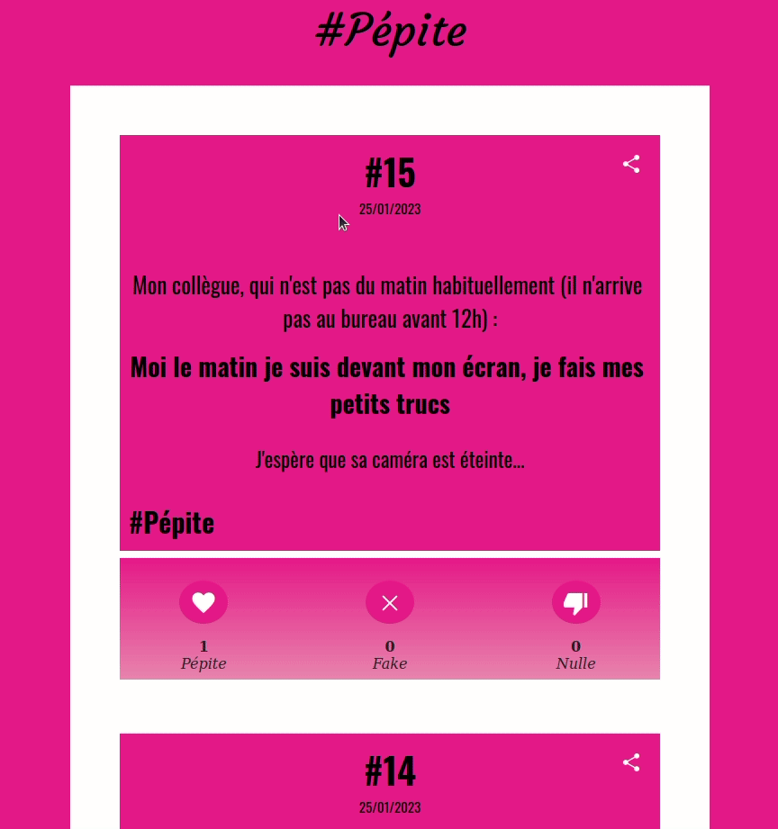

# Golden Nuggets

Project like [VDM](https://www.viedemerde.fr/) and [nuit sans follie](https://nuitsansfolie.com/) to allow co-workers to share their golden nuggets (double meaning sentences without the person involved realizing it).

For example : 
```
Talking about my new mouse, which I just unpacked, I said loud and clear in the office: It's so clean that it slips!

Maybe I should have thought about that before I started talking about it to everyone....
```



Disclaimer: projet made in few hours with some simple `flask` server and uggly raw html/js front

# Routes

| /              | dasboard         |
|----------------|------------------|
| /nugget/<id>   | show nugget <id> |
| /nugget/create | create nugget    |
| /info          | info page        |

# Server cmd

In the root of the project folder start the script `admin.py` where you can create/delete/find user and delete/edit content of a nugget

# Default credentials

| user email | admin@admin.com                                                                          |
|------------|------------------------------------------------------------------------------------------|
| user name  | admin                                                                                    |
| user token | abc123 |


# Installation

## Init env

- Rename `config.example.py` to `config.py`
- Rename `views/info.example.html` to `views/info.html`
- Change the values of `const info` in `views/info.html` which is used to handle user request (API key form, request form, report form)

## Create env
```
python -m venv venv
pip install -r requirements.txt
```

## Create database

Change the path of the database `DATABASE_PATH` in `config.py`

```
python3 initDb.py
```

## Create user

Create a new user :

```
python3 admin.py user create admin@admin.fr admin
>> API key :
lPZrMpscUcjq5VCMLROyyEdtkMri3wXxXmzxSrkTxTygKiG6JyXqcwppWVbzDTV7/t3WiBFQDRi02ftwLJ4DpA==
```

It will output an API token usefull for creating new nugget

# Run

## Local mode

```
python3 server.py
```

## Production mode

Follow the setp for the installation and apply theses changes

- Change `DEBUG` value to `False` in `config.py`
- Change `SECRET_KEY` value in `config.py`
- Change `DATABASE_PATH` in `config.py`

## Apache2

- Change all `/home/<user>` by replacing `<user>` with your current user
- Rename the current project to `/home/<user>/www/flask`
- Use the `apacheSiteAvailable.conf` with `apache2`

Install the `mod_wsgi` :
- `apt install apache2-utils ssl-cert libapache2-mod-wsgi`
- `systemctl restart apache2`
- `a2enconf mod-wsgi`

